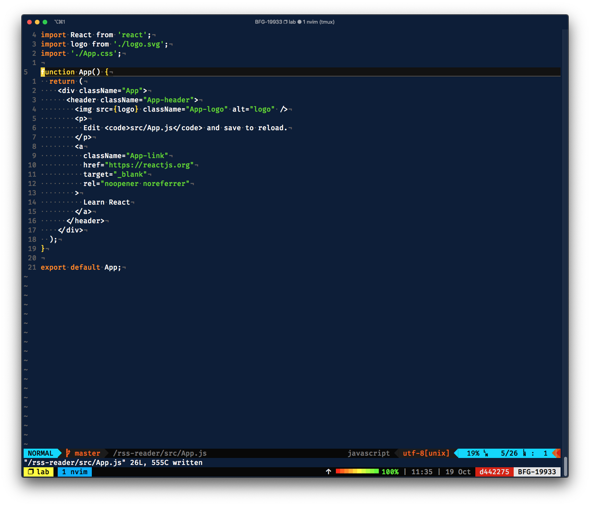

# Neovim



"Neovim is a refactor, and sometimes redactor, in the tradition of Vim (which itself derives from Stevie). It is not a rewrite but a continuation and extension of Vim. Many clones and derivatives exist, some very clever—but none are Vim. Neovim is built for users who want the good parts of Vim, and more."
You can find more information about it [here](https://neovim.io)


The configuration is organized in 4 parts:

* **GENERAL** - General configurations of the editor like encoding, undo levels, etc.
* **FORMATING / CODING** - Code editing configurations like indentation, line numbers, etc.
* **PLUGINS** - List of plugins and its respective configurations.
* **UI** - UI definitions like removing menus, highlight long lines, colorscheme, etc.

### Installation

All information can be found [here](https://github.com/neovim/neovim/wiki/Installing-Neovim), just remember to install with Python support, to be able to use [Ultisnips](https://github.com/SirVer/ultisnips), and some other plugins .

### Plugin manager

In this configuration, I used [Vim-plug](https://github.com/junegunn/vim-plug) plugin manager.
To install:
```bash
curl -fLo ~/.config/nvim/autoload/plug.vim --create-dirs \
    https://raw.githubusercontent.com/junegunn/vim-plug/master/plug.vim
```

### List of Plugins
* [ALE](https://github.com/dense-analysis/ale): Linting and fixing.
* [COC](https://github.com/neoclide/coc.nvim): Intellisense engine for vim8 & neovim, full language server protocol support.
* [ctrlp](https://github.com/kien/ctrlp.vim): Fuzzy file, buffer, mru, tag, etc finder.
* [Emmet-vim](https://github.com/mattn/emmet-vim): [Emmet](https://emmet.io/) for Vim.
* [Nerdcommenter](https://github.com/scrooloose/nerdcommenter): Commenter helper.
* [Phpactor](https://github.com/phpactor/phpactor): PHP completion, refactoring and introspection tool.
* [Ultisnips](https://github.com/SirVer/ultisnips): Snippets engine.
* [Vim-airline](https://github.com/vim-airline/vim-airline): Light status/tabline for Vim.
* [Vim-airline-theme](https://github.com/vim-airline/vim-airline-themes): Vim Airline themes.
* [Vim-fugitive](https://github.com/tpope/vim-fugitive): A Git wrapper.
* [Vim-jest-snippets](https://github.com/jhkersul/vim-jest-snippets): Jest snippets.
* [Vim-python-pep8-indent](https://github.com/Vimjas/vim-python-pep8-indent): Python indentation.
* [Vim-snippets](https://github.com/honza/vim-snippets): Default snippets for several languages.
* [Vim-surround](https://github.com/tpope/vim-surround): Quoting/parenthesizing made simple.
* [Vim-test](https://github.com/janko/vim-test): A Vim wrapper for running tests on different granularities.
* [Vim-tmux-navigator](https://github.com/christoomey/vim-tmux-navigator): Seamless navigation between tmux panes and vim splits.

# Themes
* [Cobalt2](https://github.com/herrbischoff/cobalt2.vim)
* [Dracula](https://github.com/dracula/vim)

### Running

For the first time use this command to install all necessary plugins:
```bash
nvim +PlugInstall
```
# External Dependencies

* [PHP](https://www.php.net/manual/en/install.php): A local PHP installation is used to lint PHP files.
* [ESLint](https://eslint.org/docs/user-guide/getting-started): Is used to lint Javascript and JSON files.
* [Pylint](https://www.pylint.org/): Is used to lint Python files.
* [Prettier](https://prettier.io/): Is used to beautify JSON files.

# Other tools & Resources

* [FiraCode](https://github.com/tonsky/FiraCode): Monospaced font with programming ligatures
* [ITerm2](https://www.iterm2.com/): iTerm2 is a replacement for Terminal
* [tmux](https://github.com/tmux/tmux/wiki): tmux is a terminal multiplexer
* [Zsh](https://www.zsh.org/): The Z shell (Zsh) is a Unix shell that can be used as an interactive login shell and as a command interpreter for shell scripting. Zsh is an extended Bourne shell with many improvements, including some features of Bash, ksh, and tcsh.
* [ohMyZsh](https://ohmyz.sh/): A framework for managing your Zsh configuration.
